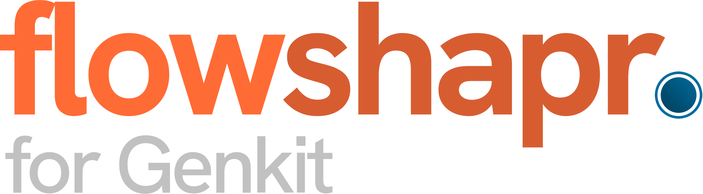
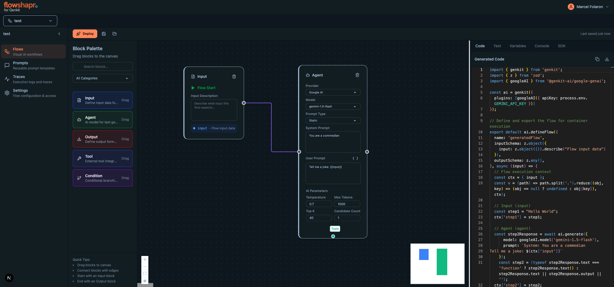

# Flowshapr

<div align="center">
  
  
  **Visual drag-and-drop canvas for Genkit AI flows**

  [](https://github.com/flowshapr/flowshapr/releases)
  [](https://github.com/flowshapr/flowshapr)
  [](https://www.gnu.org/licenses/agpl-3.0)

</div>

---

## 🚀 Try Flowshapr Cloud

**Want to get started immediately?** Try Flowshapr on our hosted platform:

**[👉 Get started at flowshapr.ai](https://flowshapr.ai)**

No installation required - build and deploy your first Genkit flow in minutes!

---

## ⚠️ Early Development Notice

**Flowshapr is in very early development with active daily updates.** Bugs and breaking changes are likely. We appreciate your patience and feedback as we build this tool.

🐛 **Found a bug?** Please [report it here](https://github.com/flowshapr/flowshapr/issues)

---

## 📸 Screenshot



---

## What is Flowshapr?

Flowshapr is a visual drag-and-drop interface for building [Firebase Genkit](https://firebase.google.com/docs/genkit) AI flows. Create, manage, and deploy Genkit flows to various platforms (Firebase, Google Cloud, AWS, or locally) using an intuitive visual editor. Developers use our thin SDK to call flows remotely.

### Key Features

- 🎨 **Visual Flow Builder** - Drag-and-drop interface powered by React Flow
- 🚀 **Real-time Code Generation** - Live TypeScript code generation from visual flows  
- ⚡ **Instant Execution** - Test and debug flows in real-time
- 🔗 **Multi-platform Deployment** - Deploy to Firebase, Google Cloud, AWS, or our platform
- 📱 **Remote SDK** - Thin SDK for calling flows from any application
- 🤝 **Team Collaboration** - Organization and team management with role-based access
- 🔧 **Node Types** - Input, Model, Prompt, Transform, Output, and Condition nodes

### Built with Firebase Genkit

Flowshapr is powered by [Firebase Genkit](https://firebase.google.com/docs/genkit), Google's AI application framework. Join the Genkit community on [Discord](https://discord.gg/qXt5zzQKpc) for support and discussions.

---

## 🐳 Quick Start with Docker

The fastest way to run Flowshapr locally is using Docker Compose:

### Prerequisites

- Docker and Docker Compose installed
- Node.js 20+ (for local development)

### 1. Clone and Start

```bash
# Clone the repository
git clone https://github.com/flowshapr/flowshapr.git
cd flowshapr

# Start all services
docker compose -f docker/docker-compose.local.yml up -d
```

### 2. Access the Application

- **Frontend**: http://localhost:3000
- **Backend API**: http://localhost:3001
- **PostgreSQL**: localhost:5432 (user: `flowshapr`, password: `flowshapr_test_password`)

### 3. Environment Configuration

For production use, copy and customize the environment files:

```bash
# Backend environment
cp server/.env.example server/.env

# Frontend environment  
cp .env.local.example .env.local
```

Edit these files with your:
- Database connection strings
- OAuth provider credentials (Google, GitHub, etc.)
- AI model API keys (OpenAI, Google AI, etc.)
- Authentication secrets

### 4. Docker Services

The Docker setup includes:
- **PostgreSQL** - Database with automatic migrations
- **Backend API** - Express.js server with domain-driven architecture
- **Frontend** - Next.js application
- **Genkit Executors** - Isolated containers for AI flow execution

### 5. Stop Services

```bash
docker compose -f docker/docker-compose.local.yml down
```

---

## 🛠️ Development Setup

### Prerequisites

- Node.js 20+
- PostgreSQL database
- AI provider API keys (optional for basic functionality)

### Backend Setup

```bash
cd server

# Install dependencies
npm install

# Copy and configure environment
cp .env.example .env
# Edit .env with your database URL and other settings

# Generate and run database migrations
npm run db:generate
npm run db:migrate

# Start development server
npm run dev
```

Backend runs on http://localhost:3001

### Frontend Setup

```bash
# From project root
cd frontend
npm install

# Copy and configure environment
cp .env.local.example .env.local
# Edit .env.local with your backend URL and other settings

# Start development server
npm run dev
```

Frontend runs on http://localhost:3000

### Development Commands

**Backend:**
```bash
cd server
npm run dev          # Start development server
npm run build        # Build for production
npm run start        # Start production server
npm run db:generate  # Generate database migrations
npm run db:migrate   # Run migrations
npm run db:studio    # Open Drizzle Studio
```

**Frontend:**
```bash
cd frontend
npm run dev          # Start development server
npm run build        # Build for production
npm run start        # Start production server
npm run lint         # Run ESLint
npm run type-check   # Run TypeScript checks
```

**Root (Workspace Commands):**
```bash
npm run dev                           # Start frontend (workspace)
npm run build                         # Build frontend and backend
npm run lint --workspace=frontend     # Lint frontend
npm run type-check --workspace=frontend # Type-check frontend
```

---

## 📡 Using the SDK

The execution endpoints are fully compatible with the [Genkit Client](https://genkit.dev/docs/client/) and you can call them using the URL provided in the SDK tab. 
Alternatively we provide a lightweight SDK to call flows via alias only and protected behind the tokens. 

### Usage with flowshapr SDK

Install
```bash
npm install @flowshapr/client
```

```typescript
import { FlowshaprClient } from '@flowshapr/client';

// Initialize the client
const client = new FlowshaprClient({
  apiKey: 'your-api-key',
  baseUrl: 'https://app.flowshapr.ai' // or your self-hosted instance
});

// Call a flow
const result = await client.executeFlow('your-flow-id', {
  input: 'Hello, world!'
});

console.log(result.data);
```

### Usage with Genkit Client

Install
```bash
npm install genkit
```

```typescript
import { runFlow } from 'genkit/beta/client';

// Call a flow using the Flowshapr proxy URL
const result = await runFlow({
  url: 'https://app.flowshapr.ai/flows/your-flow-alias/execute',
  input: 'Hello, world!'
});

console.log(result);
```


## 🏗️ Architecture

### System Overview

Flowshapr follows a three-layer architecture:

1. **Visual Editor Layer** - React Flow canvas for drag-and-drop flow building
2. **Code Generation Layer** - Template-based TypeScript code generation
3. **Execution Layer** - Firebase Genkit integration for AI workflow execution

### Backend (Express.js)
- **Authentication** - Better Auth with social providers
- **Database** - PostgreSQL with Drizzle ORM
- **API** - RESTful API with role-based access control
- **Architecture** - Domain-driven design with clear separation of concerns

### Frontend (Next.js)
- **UI Framework** - React with TypeScript and Tailwind CSS
- **Flow Editor** - React Flow for visual editing
- **Code Preview** - Monaco Editor with syntax highlighting
- **State Management** - Zustand for client state

### Node Types

- **Input Node** - Define flow inputs (text, JSON, files)
- **Model Node** - Select AI models (Gemini, OpenAI, Claude)
- **Prompt Node** - Create templates with variables
- **Transform Node** - Data transformation logic
- **Output Node** - Configure flow outputs
- **Condition Node** - Conditional branching

### Project Structure

```
├── docker/                 # Docker configuration
├── server/                 # Express.js backend
│   ├── src/
│   │   ├── domains/       # Business domains (auth, flows, etc.)
│   │   ├── shared/        # Shared utilities and middleware
│   │   └── infrastructure/ # Database and external integrations
│   └── drizzle/           # Database migrations
├── src/                   # Next.js frontend
│   ├── app/              # App Router pages and API routes
│   ├── components/       # React components
│   ├── features/         # Feature-specific components
│   └── lib/              # Utilities and configurations
├── sdk/                   # Remote execution SDK
└── docs/                 # Documentation
```

---

## 🤝 Contributing

We welcome contributions! Flowshapr is in active development and there are many ways to help:

1. **Report Bugs** - Create detailed issue reports
2. **Feature Requests** - Suggest new capabilities
3. **Code Contributions** - Submit pull requests
4. **Documentation** - Help improve our docs
5. **Community Support** - Help others in discussions

### Development Process

1. Fork the repository
2. Create your feature branch (`git checkout -b feature/amazing-feature`)
3. Make your changes following our coding standards
4. Test your changes thoroughly
5. Commit your changes (`git commit -m 'Add amazing feature'`)
6. Push to the branch (`git push origin feature/amazing-feature`)
7. Open a Pull Request

### Code Standards

- Follow existing code style and patterns
- Use TypeScript with proper typing
- Write tests for new functionality
- Follow domain-driven design principles in backend
- Keep components focused and reusable in frontend

---

## 📄 License

This project is licensed under the **GNU Affero General Public License v3.0** (AGPL-3.0).
See the [LICENSE](LICENSE) file for full details.

---

## 🔗 Links

- **Website**: [flowshapr.ai](https://flowshapr.ai)
- **Documentation**: [docs.flowshapr.ai](https://docs.flowshapr.ai)
- **Firebase Genkit**: [firebase.google.com/docs/genkit](https://firebase.google.com/docs/genkit)
- **Genkit Discord**: [discord.gg/qXt5zzQKpc](https://discord.gg/qXt5zzQKpc)
- **GitHub Issues**: [Report bugs and request features](https://github.com/flowshapr/flowshapr/issues)

---

<div align="center">
  
**Made with ❤️ by the Flowshapr Team**

[⭐ Star us on GitHub](https://github.com/flowshapr/flowshapr) • [🐛 Report Issues](https://github.com/flowshapr/flowshapr/issues) • [💬 Join Discord](https://discord.gg/qXt5zzQKpc)

</div>